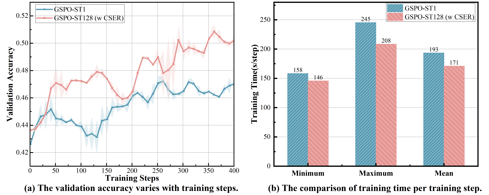
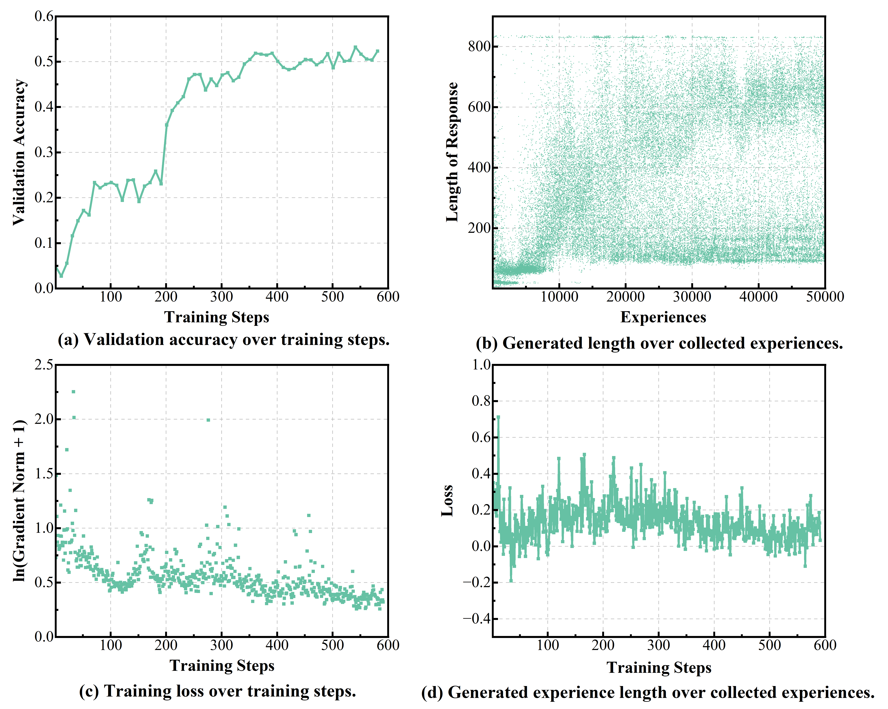
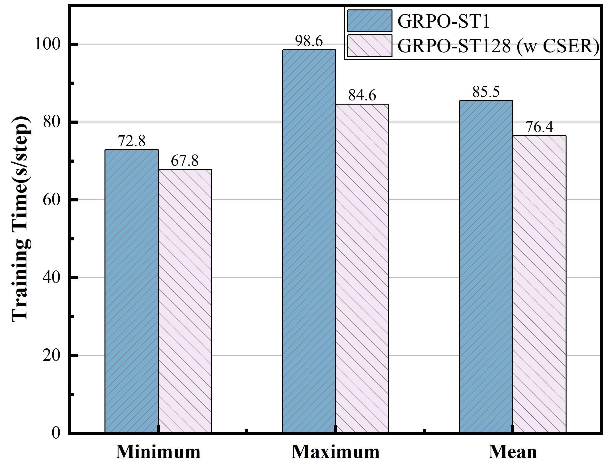

# CSER 审稿材料

[English version](README.md)

本仓库是 CSER 论文的匿名审稿材料，仅用于审稿阶段查看。提供本仓库的目的是方便审稿人检查主要方法实现，尤其是陈旧度感知回放、序列级经验回放、时间信用校准、采样以及损失函数更新逻辑。

本材料有意不作为完整训练系统运行。FSDP/vLLM worker 的分布式运行时启动代码、GPU 放置、NCCL 设置、端口以及私有集群路径等具体内容已被省略，或替换为仅供审稿使用的占位内容。

## 补充材料

以下各节面向审稿补充材料。

本补充材料围绕“可核查性”和“补充证据”组织：首先说明分布式 RLVR 实验所使用的软硬件环境和关键超参数，便于审稿人理解实验配置；随后给出正文主实验之外的补充结果，覆盖额外的 GRPO-style 基础目标、可验证任务和效率对比；随后补充冻结信用残差的推导细节；最后提供建议的代码阅读顺序，帮助审稿人快速定位 CSER 中与经验回放、时间信用校准和损失更新相关的实现。

### 实验设置与环境

实验在基于 OpenMPI 的分布式 RLVR 训练框架中进行。四个 actor 进程同时执行 rollout，并使用 vLLM 作为推理加速库。四个 learner 进程并行执行策略更新，并使用 Fully Sharded Data Parallel（FSDP）作为训练加速库。本审稿材料保留了与方法相关的编排和损失逻辑，而集群相关的启动细节已按前文说明省略。

软硬件环境配置如下：

| 类别 | 配置 |
| --- | --- |
| 操作系统 | Ubuntu 18.04.4 LTS，Linux kernel 4.15.0-76-generic |
| CPU | 2 x Intel(R) Xeon(R) Gold 6242R CPU @ 3.10GHz|
| 内存 | 376 GB RAM，975 MB swap |
| GPU | 4 x NVIDIA A800 80GB；8 x NVIDIA A40 40GB|
| GPU 互联 | PCIe|
| GPU 驱动 | NVIDIA driver 545.29.06|
| MPI | Open MPI 5.0.7，MPI API 3.1.0 |
| 随机性种子 | 42 |

不同的算法和应用超参数设置有差异，具体见 `configs/`。超参数参考值如下：

| 参数 | 说明 | 取值 |
| --- | --- | ---: |
| `max prompt length` | 最大 query token 长度。 | 1000 |
| `max response length` | 最大 response token 长度。 | 2500 |
| `query_batchsize` | 每个 batch 采样的 query 数量。 | 24 |
| `group` | GRPO 中每个 prompt 的 rollout 数量。 | 8 |
| `rollout_mini_batchsize` | 每个 rollout mini-batch 处理的样本数。 | 48 |
| `temperature` | Rollout 采样温度。 | 1.0 |
| `filter` | 是否丢弃 response 全部正确或全部错误的样本。 | True |
| `er_lambda` | 回放经验数量相对于 `train_batchsize` 的比例。 | 0.25 |
| `train_batchsize` | 每个优化步的全局训练 batch size。 | 192 |
| `train_mini_batchsize` | 每次反向传播处理的样本数。 | 16 |
| `accumulation_steps` | 梯度累积步数。 | 3 |
| `lr` | 学习率。 | 1e-6 |
| `adv_gamma` | Advantage correction 的衰减系数。 | 0.95 |
| `clip_range` | Importance ratio 的裁剪范围。 | 0.2 |

### 实验结果
本节提供正文主实验之外的补充结果，用于进一步检验 CSER 的适用范围和实际训练收益。与正文主要聚焦 GRPO/VESPO、GSM8K/MATH12K 以及核心稳定性分析不同，这里从三个角度展开：首先，将 CSER 接入 GSPO，检验其对不同 GRPO-style 基础目标的插件式适配能力；其次，在 CountDown 组合算术任务和 Qwen2.5-1.5B-Instruct 上评估训练动态，验证其在不同可验证任务和其它模型规模上的稳定性；最后，比较达到相同目标性能所需的样本消耗和单步训练耗时，以展示经验回放带来的效率收益。

#### GSPO 算法

为检验 CSER 对正文主实验之外的 GRPO-style 基础目标是否仍然有效，我们将其接入 GSPO 并进行补充评估。论文正文将 GSPO 归为序列级 GRPO 方法：该目标将 importance ratio、clipping 与优化过程从 token 级转移到 sequence 级，因此可作为检验 CSER 插件式适配能力的代表性设置。

如图 (a) 所示，在高 staleness 的 ST128 回放设置下，GSPO-ST128 (w CSER) 的验证准确率最高达到 51.33\%，较 on-policy GSPO-ST1 提高 7.97 个百分点，并在训练后半段保持更高的验证准确率。如图 (b) 所示，CSER 还降低了单步训练耗时：GSPO-ST128 (w CSER) 的平均单步时间为 171 秒，而 GSPO-ST1 为 193 秒，对应 11.4\% 的加速。该结果表明，CSER 的时间信用校准与序列级经验回放不仅适用于正文中的 GRPO/VESPO 设置，也可与 GSPO 这类序列级目标结合，在高 staleness 场景下同时提升验证表现和训练效率。
#### CountDown任务

CountDown 是一种可自动验证的组合算术任务。给定一个目标数和若干可用数字，模型需要通过加、减、乘、除等基本运算构造一个表达式，使表达式的计算结果等于目标数，并通常要求每个给定数字至多使用一次。由于最终答案可以由程序直接校验，该任务适合用于 RLVR 训练，并能检验模型在搜索、规划和精确算术组合上的能力。

我们将 CountDown 作为正文数学推理数据集之外的补充应用，用于检验 CSER 在不同可验证任务和其它模型规模上的适用性。本实验使用 Qwen2.5-1.5B-Instruct，并在高 staleness 的 GRPO-ST128 (w CSER) 设置下训练。上图展示了训练过程中的验证表现、生成长度和优化动态。如图 (a) 所示，验证准确率随着训练推进逐渐上升并趋于平稳，从 4.79\% 提升至 53.22\%，说明模型在组合算术搜索任务上持续获得有效学习信号。如图 (b) 所示，生成 experience 的长度从训练早期的小于 100 tokens 逐渐增大，且 CountDown 任务中的生成长度方差较大，反映出模型在训练后期会探索更长、更多样的推理路径。如图 (c) 和图 (d) 所示，$\ln(g+1)$ 与 loss 均随训练步数逐渐进入更稳定的波动区间，表明高 staleness 回放没有导致明显的梯度失控或优化崩溃。整体来看，该结果表明，CSER 在 CountDown 这类组合式可验证任务上也能支持稳定的经验回放训练。

#### 效率对比

本节进一步比较 CSER 在达到相同目标性能时的样本消耗和单步训练耗时。表中统计了 on-policy GRPO-ST1 与 GRPO-ST128 (w CSER) 在收敛到目标验证准确率时的训练开销，其中 rollout 样本数表示需要实时生成的新样本数量，训练样本数表示进入 learner 更新的样本总数（包括新生成样本和回放样本）。

| 指标 | GRPO-ST1 | GRPO-ST128 (w CSER) | 相对 GRPO-ST1 变化 |
| --- | ---: | ---: | ---: |
| 训练步数 | 511 | 331 | -35.24\% |
| 总 rollout 样本数 | 98112 | 42432 | -56.75\% |
| 总训练样本数 | 98112 | 63552 | -35.22\% |
| 回放比例 | 0 | 33.23\% | - |

结果显示，GRPO-ST128 (w CSER) 将达到目标性能所需的训练步数从 511 降至 331，并将实时生成的 rollout 样本数从 98112 降至 42432，对应 56.75\% 的新样本生成开销下降。虽然 CSER 在训练中额外引入了 33.23\% 的回放样本，但总训练样本数仍从 98112 降至 63552，说明回放机制在减少新鲜 rollout 需求的同时提高了已有样本的利用率。

图中进一步给出了两种设置的单步训练耗时。与 GRPO-ST1 相比，GRPO-ST128 (w CSER) 的最小、最大和平均单步耗时分别从 72.8、98.6 和 85.5 秒降至 67.8、84.6 和 76.4 秒，平均单步耗时降低 10.64\%。这一结果表明，在当前实现中，CSER 带来的回放检索和缓存管理开销没有抵消其减少实时 rollout 的收益。考虑到当前实现仍包含较明显的通信和调度开销，进一步优化系统实现后，CSER 的端到端效率优势仍有继续扩大的空间。

### 理论分析

#### 冻结信用残差的推导

本节展开正文中冻结信用残差的推导。推导的目的，是分离 on-policy GRPO 更新中原本耦合在一起的两个量：response 分布，以及分配给某个 response 的组相对 credit。

对于固定的 query $q$ 和固定的 response $o$，令 $O_{-o}$ 表示与 $o$ 一起构成 GRPO response group 的 $G-1$ 个 peer responses。当 peer responses 从历史策略 $\pi_{\theta_{t-k}}$ 中采样时，定义 $o$ 的期望组相对 credit 为

$$
\begin{aligned}
\bar A_{t-k}(o;q)
&= \mathbb{E}_{O_{-o}\sim\pi_{\theta_{t-k}}(\cdot\mid q)}
\left[
\frac{\rho(q,o)-\mu(q;o,O_{-o})}
{\sigma(q;o,O_{-o})+\epsilon_A}
\right],
\end{aligned}
$$

其中，$\mu(q;o,O_{-o})$ 和 $\sigma(q;o,O_{-o})$ 分别表示由 $o$ 和 $O_{-o}$ 组成的 response group 的 reward 均值和标准差。类似地，当 peer responses 从当前策略 $\pi_{\theta_t}$ 中采样时，定义

$$
\begin{aligned}
\bar A_t(o;q)
&= \mathbb{E}_{O_{-o}\sim\pi_{\theta_t}(\cdot\mid q)}
\left[
\frac{\rho(q,o)-\mu(q;o,O_{-o})}
{\sigma(q;o,O_{-o})+\epsilon_A}
\right].
\end{aligned}
$$

因此，$\bar A_{t-k}(o;q)$ 和 $\bar A_t(o;q)$ 的区别仅在于：用于组相对归一化的 peer responses 是由哪个策略生成的。

现在考虑回放一个由历史策略采样得到的 response。假设在回放支持集上，当前 response 分布相对于历史 response 分布绝对连续。使用精确的序列级 importance weighting 时，使用历史组相对 credit 的 replay gradient 为

$$
\begin{aligned}
g_{t-k}(\theta_t)
&= \mathbb{E}_{q\sim\mathcal D}
\mathbb{E}_{o\sim\pi_{\theta_{t-k}}(\cdot\mid q)}
\left[
\frac{\pi_{\theta_t}(o\mid q)}
{\pi_{\theta_{t-k}}(o\mid q)}
\bar A_{t-k}(o;q)
\nabla_{\theta_t}\log\pi_{\theta_t}(o\mid q)
\right] \\
&= \mathbb{E}_{q\sim\mathcal D}
\mathbb{E}_{o\sim\pi_{\theta_t}(\cdot\mid q)}
\left[
\bar A_{t-k}(o;q)
\nabla_{\theta_t}\log\pi_{\theta_t}(o\mid q)
\right].
\end{aligned}
$$

importance ratio 将采样测度从 $\pi_{\theta_{t-k}}$ 变为 $\pi_{\theta_t}$，但 credit 项仍然是 $\bar A_{t-k}(o;q)$，因为它由历史 peer responses 决定。对应的当前策略 fresh group 参考梯度为

$$
\begin{aligned}
g_t(\theta_t)
&= \mathbb{E}_{q\sim\mathcal D}
\mathbb{E}_{o\sim\pi_{\theta_t}(\cdot\mid q)}
\left[
\bar A_t(o;q)
\nabla_{\theta_t}\log\pi_{\theta_t}(o\mid q)
\right].
\end{aligned}
$$

使用紧凑记号 $\mathbb{E}_{q,o}$ 表示 $q\sim\mathcal D$ 且 $o\sim\pi_{\theta_t}(\cdot\mid q)$，则带有冻结 credit 的精确比例校正 replay 与当前策略 fresh group 参考梯度之间的残差为

$$
\begin{aligned}
B_A
&= g_{t-k}(\theta_t)-g_t(\theta_t) \\
&= \mathbb{E}_{q,o}
\left[
\bigl(\bar A_{t-k}(o;q)-\bar A_t(o;q)\bigr)
\nabla_{\theta_t}\log\pi_{\theta_t}(o\mid q)
\right].
\end{aligned}
$$

这就是正文中使用的冻结信用残差。

#### 冻结信用残差的上界

从上文推导得到的冻结信用残差出发，

$$
\begin{aligned}
B_A
&= \mathbb{E}_{q,o}
\left[
\bigl(\bar A_{t-k}(o;q)-\bar A_t(o;q)\bigr)
\nabla_{\theta_t}\log\pi_{\theta_t}(o\mid q)
\right],
\end{aligned}
$$

其中 $\mathbb{E}_{q,o}$ 表示 $q\sim\mathcal D$ 且 $o\sim\pi_{\theta_t}(\cdot\mid q)$。下面推导正文中使用的 illustrative bound。假设条件 credit mismatch 随 policy distance 平滑变化，即

$$
\begin{aligned}
\left|
\bar A_{t-k}(o;q)-\bar A_t(o;q)
\right|
&\le L_A d(\pi_{\theta_{t-k}},\pi_{\theta_t}),
\end{aligned}
$$

并假设 score norm 有界：

$$
\begin{aligned}
\left\|
\nabla_{\theta_t}\log\pi_{\theta_t}(o\mid q)
\right\|_2
&\le G_s.
\end{aligned}
$$

则有

$$
\begin{aligned}
\|B_A\|_2
&= \left\|
\mathbb{E}_{q,o}
\left[
\bigl(\bar A_{t-k}(o;q)-\bar A_t(o;q)\bigr)
\nabla_{\theta_t}\log\pi_{\theta_t}(o\mid q)
\right]
\right\|_2 \\
&\le \mathbb{E}_{q,o}
\left[
\left|
\bar A_{t-k}(o;q)-\bar A_t(o;q)
\right|
\left\|
\nabla_{\theta_t}\log\pi_{\theta_t}(o\mid q)
\right\|_2
\right] \\
&\le L_A G_s d(\pi_{\theta_{t-k}},\pi_{\theta_t}).
\end{aligned}
$$

这就是正文中给出的冻结信用残差上界。

### 审稿人阅读指南

建议审稿人按以下顺序阅读：

1. 阅读 `run.py` 和 `run_lora.py`，了解 Actor/Buffer/Learner 编排。
2. 阅读 `utils/experience.py`，了解回放、时间衰减和采样。
3. 阅读 `utils/fsdp_worker.py` ，了解目标函数与更新逻辑。
4. 阅读 `configs/`，查看示例配置。
